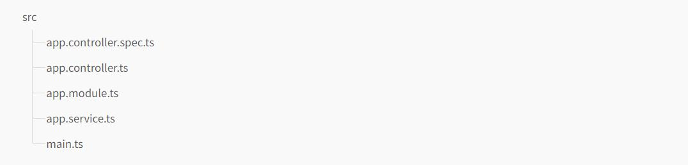

# Nestjs Tutorial

<p align="center">
  <a href="http://nestjs.com/" target="blank"></a>
</p>

<p align="center"><i>A progressive <b><a href="http://nodejs.org">Node.js</a></b> framework for building efficient, reliable and scalable server-side applications.</i></p>

## Introduction

Nest (NestJS) is a framework for building efficient, scalable [**Node.js**](https://nodejs.org) server-side applications. It uses progressive JavaScript, is built with and fully supports [**TypeScript**](http://www.typescriptlang.org) (yet still enables developers to code in pure JavaScript) and combines elements of OOP (Object Oriented Programming), FP (Functional Programming), and FRP (Functional Reactive Programming).

Under the hood, Nest makes use of robust HTTP Server frameworks like [**Express**](https://expressjs.com) (the default) and optionally can be configured to use [**Fastify**](https://github.com/fastify/fastify) as well!

Nest provides a level of abstraction above these common Node.js frameworks (Express/Fastify), but also exposes their APIs directly to the developer. This gives developers the freedom to use the myriad of third-party modules which are available for the underlying platform.

### Installation

To get started, you need to install the [**Nest CLI**](https://docs.nestjs.com/cli/overview) once if your local machine doesn't exist.

```shell
# install Nest CLI as global dependency
$ npm i -g @nestjs/cli
# then create a project using `nest` command
$ nest new project-name
```

> To create a new project with TypeScript's `strict` mode enabled, pass the `--strict` flag to the `nest new` command.

The `project-name` directory will be created, node modules and a few other boilerplate files will be installed, and a `src/` directory will be created and populated with several core files.



Here's a brief overview of those core files:

- `app.controller.ts`: A basic controller witha single route.
- `app.controller.spec.ts`: The unit tests for the controller.
- `app.module.ts`: The root module of the application.
- `app.service.ts`: A basic service with a single method.
- `main.ts`: The entry file of the application which uses the core function `NestFactory` to create a Nest application instance.

The `main.ts` includes an async function, which will **bootstrap** our application:

```ts
// main.ts
import { NestFactory } from "@nestjs/core";
import { AppModule } from "./app.module";

async function bootstrap() {
  const app = await NestFactory.create(AppModule);
  await app.listen(3000);
}
bootstrap();
```

To create a Nest application instance, we use the core `NestFactory` class. `NestFactory` exposes a few static methods that allow creating an application instance. The `create()` method returns an application object, which fulfills the `INestApplication` interface. This object provides a set of methods which are described in the coming chapters. In the `main.ts` example above, we simply start up our HTTP listener, which lets the application await inbound HTTP requests.

### Running the application

Once the installation process is complete, you can run the follwing command at your OS command prompt to start the application listening for inbound HTTP requests:

```shell
$ npm run start
```

This command starts the app with the HTTP server listening on the port defined in the `src/main.ts` file. Once the application is running, open your browser and navigate to `http://localhost:3000/`. You should see the `Hello World!` message.

To watch for changes in your files, you can run the following command to start the application:

```shell
$ npm run start:dev
```

This command will watch your files, automatically recompiling and reloading the server.

### Alternatives

Alternatively, to install the TypeScript starter project with Git:

```shell
# clone the project
$ git clone https://github.com/nestjs/typescript-starter.git project
# go into project folder
$ cd project
# install dependencies
$ npm install
# run application
$ npm run start
```

> If you'd like to clone the repository without the git history, you can use [**degit**](https://github.com/Rich-Harris/degit).

Open your browser and navigate to `http://localhost:3000/`.

To install the JavaScript flavor of the starter project, use `javascript-starter.git` in the command sequence above.

[🔼 Back to top](#nestjs-tutorial)

## Controllers

Controllers are responsible for handling incomming **requests** and returning **responses** to the client.


A controller's purpose is to receive specific requests for the application. The **routing** mechanism controls which controller receives which requests. Frequently, each controller has more than one route, and different routes can perform different actions.

In order to create a basic controller, we use classes and **decorators**. Decorators associate classes with required metadata and enable Nest to create a routing map (tie requests to the corresponding controllers).

### Routing

In the following example we'll use the `@Controller()` decorator, which is **required** to define a basic controller. We'll specify an optional route path prefix of `cats`. Using a path prefix in a `@Controller()` decorator allows us to easily group a set of related routes, and minimize repetitive code. For example, we may choose to group a set of routes that manage interactions with a cat entity under the route `/cats`. In that case, we could specify the path prefix `cats` in the `@Controller()` decorator so that we don't have to repeat that portion of the path for each route in the file.

```ts
// cats.controller.ts;
import { Controller, Get } from "@nestjs/common";

@Controller("cats")
export class CatsController {
  @Get()
  findAll(): string {
    return "This action returns all cats";
  }
}
```

> To create a controller using the CLI, simply execute the `$ nest g controller cats` command.

The `@Get()` HTTP request method decorator before the `findAll()` method tells Nest to create a handler for a specific endpoint for HTTP requests. The endpoint corresponds to the HTTP request method (GET in this case) and the route path. What is the route path? The route path for a handler is determined by concatenating the (optional) prefix declared for the controller, and any path specified in the method's decorator. Since we've declared a prefix for every route (`cats`), and haven't added any path information in the decorator, Nest will map `GET /cats` requests to this handler. As mentioned, the path includes both the optional controller path prefix **and** any path string declared in the request method decorator `@Get('breed')` would produce a route mapping for requests like `GET /cats/breed`.

This method will return a 200 status code and the associated response, which in this case is just a string. Why does that happen? To explain, we'll first introduce the concept that Nest employs two **different** options for maniplulating responses:

- Using this built-in method, when a request handler returns a JavaScript object or array, it will **automatically** be serialized to JSON. When if returns a JavaScript primitive type(e.g., `string`, `number`, `boolean`), however, Nest will send just the value without attempting to serialize it. This makes response handling simple: just return the value, and Nest takes care of the rest.

  Futhermore, the response's **status code** is always 200 by default, except for POST requests which use 201. We can easily change this behavior by adding the `@HttpCode(...)` decorator at a handler-level.

### Request object

Handlers often need access to the client **request** details. Nest provides access to the [**request object**](https://expressjs.com/en/api.html#req) of the underlying platform (Express by default). We can access the request object by instructing Nest to inject it by adding the `@Req()` decorator to the handler's signature.

```ts
// cats.controller.ts;
import { Controller, Get, Req } from "@nestjs/common";
import { Request } from "express";

@Controller("cats")
export class CatsController {
  @Get()
  findAll(@Req() request: Request): string {
    return "This action returns all cats";
  }
}
```

> In order to take advantage of `express` typings (as in the `request: Request` parameter example above), install `@types/express` package.

The request object represents the HTTP request and has properties for the request query stirng, parameters, HTTP handlers, and body (read more [**here**](https://expressjs.com/en/api.html#req)). In most cases, it's not nessary to grab these properties manually. We can use dedicated decorators instead, such as `@Body()` or `@Query()`, which are available out of the box. Below is a list of the provided decorators and the plain platform-specific objects they represent.


For compatibility with typings across underlying HTTP platforms (e.g., Express and Fastify), Nest provides `@Res()` and `@Response()` decorators. `@Res()` is simply an alias for `@Response()`. Both directly expose the underlying native platform `response` object interface. When using them, you should also import the typings for the underlying library (e.g., `@types/express`) to take full advantage. Note that when you inject either `@Res()` or `@Response()` in a method handler, you become responsible for managing the response. When doing so, you must issue some kind of response by making a call on the `response` object (e.g., `res.json(...)` or `res.send(...)`), or the HTTP server will hang.

### Resources

Earlier, we defined an endpoint to fetch the cats resource(**GET** route). We'll typically also want to provide an endpoint that creates new records. Fot this, let's create the **POST** handler:

```ts
// cats.controller.ts;
import { Controller, Get, Post } from "@nestjs/common";

@Controller("cats")
export class CatsController {
  @Post()
  create(): string {
    return "This action adds a new cat";
  }

  @Get()
  findAll(): string {
    return "This action returns all cats";
  }
}
```

It's that simple. Nest provides decorators for all of the standard HTTP methods: `@Get()`, `@Post()`, `@Put()`, `@Delete()`, `@Patch()`, `@Options()`, and `@Head()`. In addition, `@All()` defines an endpoint that handles all of them.

### Route wildcards

Pattern based routes are supported as well. For instance, the asterisk is used as a wildcard, and will match any combination of characters.

```ts
@Get('ab*cd')
findAll() {
  return 'This route uses a wildcard';
}
```

The `ab*cd` route path will match `abcd`, `ab_cd`, `abecd`, and so on. The character `?`, `+`, `*`, and `()` may be used in a route path, and are subsets of their regular expression counterparts. The hyphen (`-`) and the dot(`.`) are interpreted literally by string-based paths.

### Status code

As mentioned, the response **status code** is always **200** by default, except for POST requests which are **201**. We can easily change this behavior by adding the `@HttpCode(...)` decorator at a handler level.

```ts
@Post()
@HttpCode(204)
create() {
  return 'This action adds a new cat';
}
```

> Import `HttpCode` from the `@nestjs/common` package.

Often, your status code isn't static but depends on various factors. In that case, you can use a library-specific **response** (inject using `@Res()`) object (or, in case of an error, throw an exception).

[🔼 Back to top](#nestjs-tutorial)

### 📜 References

- [Nestjs Documentation](https://docs.nestjs.com)

### 🤝 Contributors

- Mengsreang-Chhoeung [@mengsreang_dev](https://twitter.com/mengsreang_dev)
